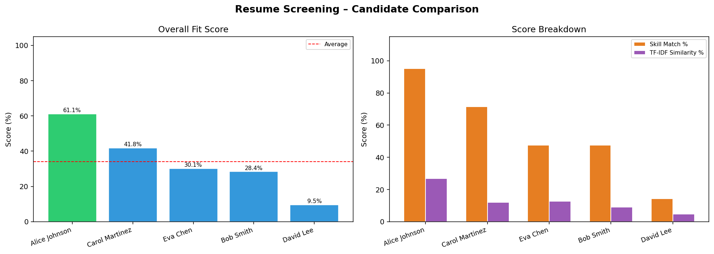
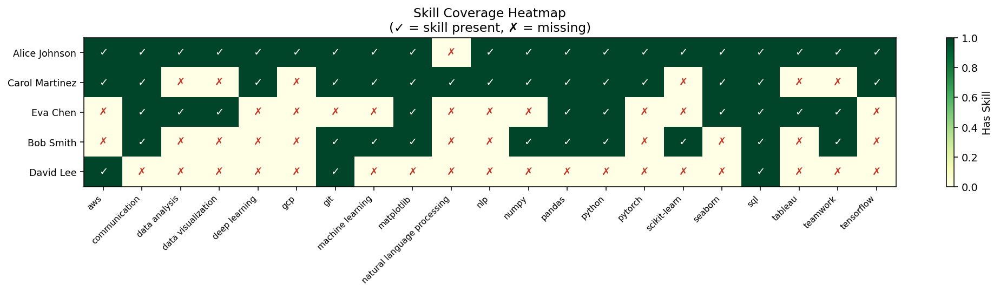
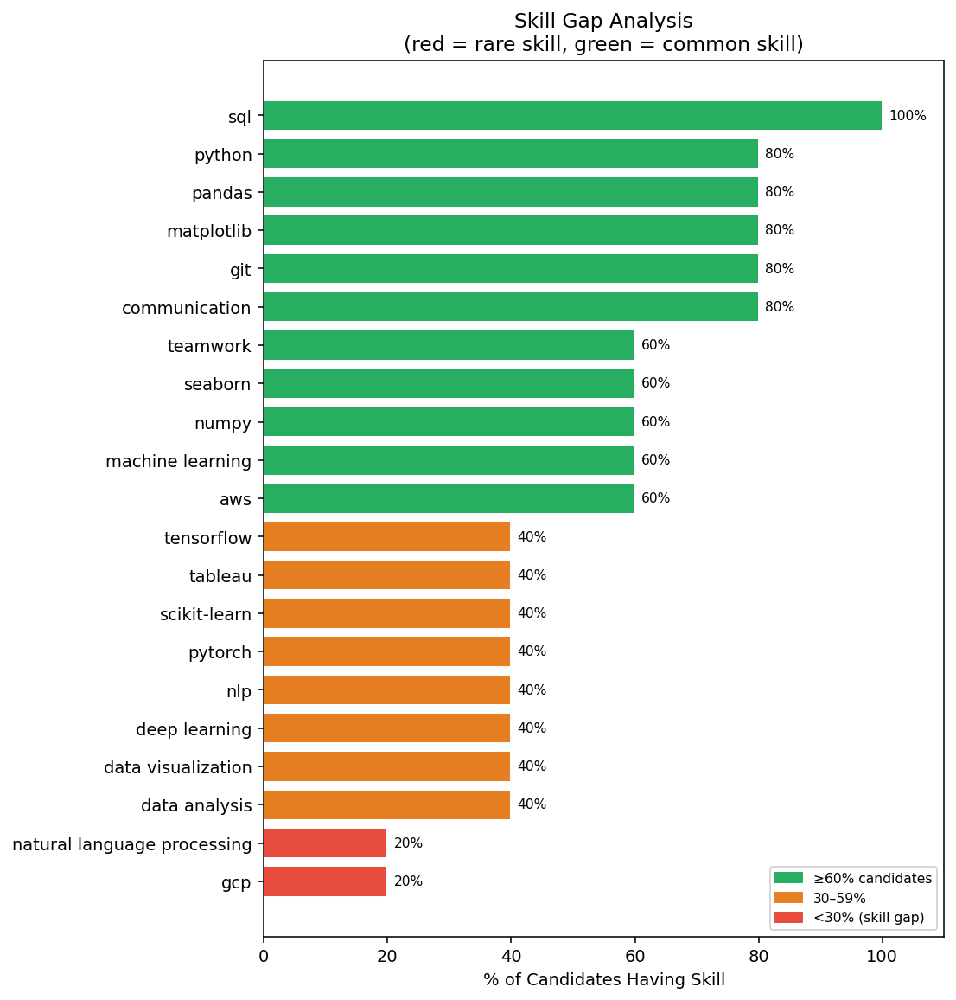

# 🔍 Resume / Candidate Screening System
### Future Interns – Machine Learning Task 3 (2026)


An end-to-end **NLP-powered Machine Learning system** that automatically **screens, scores, ranks resumes** and identifies **skill gaps** based on a given job role.

---

## 📸 Output Preview

### Candidate Score Comparison


### Skill Coverage Heatmap


### Skill Gap Analysis


---

## 🎯 About the Task

Hiring teams receive hundreds of resumes for a single job role. Manually reading each resume is slow, inconsistent, and error-prone. This project builds a real ML system that:

- ✅ Reads and cleans resume text
- ✅ Extracts skills using NLP
- ✅ Compares resumes with a job description
- ✅ Scores and ranks candidates based on role fit
- ✅ Highlights missing or required skills

---

## 📁 Project Structure

```
resume-screening-system/
├── resume_screener.py     # Core pipeline (preprocessor, skill extractor, screener)
├── sample_data.py         # Sample resumes & job descriptions
├── Main.py                # Run this to screen candidates
├── Visualise.py           # Run this to generate charts
├── requirements.txt       # All dependencies
├── README.md
└── outputs/
    ├── results.csv            # Ranked candidates table
    ├── candidate_scores.png   # Score comparison chart
    ├── skill_heatmap.png      # Skill coverage heatmap
    └── skill_gap.png          # Skill gap analysis chart
```

---

## ⚙️ Setup & Installation

```bash
# 1. Clone the repository
git clone https://github.com/gauathrinaiduallu/FUTURE_ML_03.git
cd FUTURE_ML_03

# 2. Install dependencies
pip install -r requirements.txt

# 3. Download spaCy English model
python -m spacy download en_core_web_sm
```

---

## 🚀 How to Run

### Screen Candidates
```bash
python main.py
```

### Choose a Specific Job Role
```bash
python main.py --role ml_engineer
python main.py --role frontend_developer
python main.py --role data_scientist
```

### Use Your Own Resume CSV
```bash
python main.py --csv your_resumes.csv --role data_scientist
```
> CSV must have columns: `name` and `resume_text`

### Generate Visual Charts
```bash
python visualise.py
```

---

## 🧠 How It Works

```
Raw Resume Text
      │
      ▼
Text Preprocessing
(lowercase → remove noise → lemmatize → remove stopwords)
      │
      ▼
Skill Extraction
(pattern matching against 70+ skill keywords)
      │
      ▼
TF-IDF Vectorisation
(resume + JD converted to numerical vectors)
      │
      ▼
Cosine Similarity
(semantic match score between resume and JD)
      │
      ▼
Combined Score = 50% Skill Score + 50% TF-IDF Score
      │
      ▼
Ranked Candidates + Skill Gap Report
```

### Scoring Formula

| Component | Description | Weight |
|-----------|-------------|--------|
| **Skill Score** | % of JD-required skills found in resume | 50% |
| **TF-IDF Cosine Similarity** | Semantic text similarity to job description | 50% |

### Why Candidates Rank Higher
A candidate ranks higher when they:
1. Have **more matching skills** from the job description
2. Have **text semantically similar** to the job description
3. Use relevant keywords throughout their resume

---

## 📊 Sample Terminal Output

```
╔══════════════════════════════════════════════╗
║  Resume / Candidate Screening System         ║
║  Future Interns – ML Task 3 (2026)           ║
╚══════════════════════════════════════════════╝

📌 Selected Role : Data Scientist
✅ Job description loaded. Required skills detected: 21

═══════════════════════════════════════════════════════════════════
         📋  RESUME SCREENING REPORT
═══════════════════════════════════════════════════════════════════

# 1  Alice Johnson      [██████████████████░░░░░░░░░░░░]   61.1%
     ✅ Matched (20): aws, communication, data analysis, deep learning ...
     ❌ Missing  (1): natural language processing

# 2  Carol Martinez     [████████████░░░░░░░░░░░░░░░░░░]   41.8%
     ✅ Matched (15): aws, communication, deep learning, git ...
     ❌ Missing  (6): data analysis, gcp, scikit-learn, tableau ...

🏆  Top Candidate: Alice Johnson  |  Score: 61.1%
═══════════════════════════════════════════════════════════════════
```

---

## 🛠️ Tech Stack

| Tool | Purpose |
|------|---------|
| **Python** | Core language |
| **spaCy** | NLP pipeline & Named Entity Recognition |
| **NLTK** | Tokenisation, stopwords, lemmatisation |
| **scikit-learn** | TF-IDF vectorisation & cosine similarity |
| **pandas / numpy** | Data handling & scoring |
| **matplotlib** | Visualisation charts |

---

## 📋 Available Job Roles

| Role Key | Description |
|----------|-------------|
| `data_scientist` | Python, ML, deep learning, NLP, pandas, AWS |
| `ml_engineer` | PyTorch, MLOps, Docker, Kubernetes, CI/CD |
| `frontend_developer` | React, TypeScript, HTML/CSS, REST API |

---

## 💡 Extending the System

- Add **PDF resume parsing** with `pdfplumber`
- Plug in the **Kaggle Resume Dataset** as a CSV
- Build a **Streamlit web UI** for HR teams
- Add **weighted skill importance** (e.g. Python = 3×)
- Use **sentence-transformers** for deeper semantic matching

---

## 👤 Author
### ALLU GAYATHRI

Built as part of the **Future Interns Machine Learning Internship – Task 3 (2026)**

🔗 [Future Interns](https://futureinterns.com/machine-learning-task-3-2026/) | 
🔗 [LinkedIn – Future Interns](https://www.linkedin.com/company/future-interns/)

---

*⭐ Star this repo if you found it helpful!*
